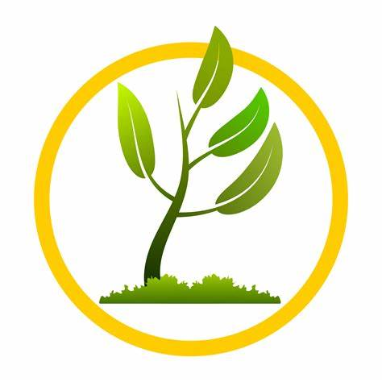

<!-- Improved compatibility of back to top link: See: https://github.com/othneildrew/Best-README-Template/pull/73 -->
<a name="readme-top"></a>
<!--
*** Thanks for checking out the Best-README-Template. If you have a suggestion
*** that would make this better, please fork the repo and create a pull request
*** or simply open an issue with the tag "enhancement".
*** Don't forget to give the project a star!
*** Thanks again! Now go create something AMAZING! :D
-->


<!-- PROJECT SHIELDS -->
<!--
*** I'm using markdown "reference style" links for readability.
*** Reference links are enclosed in brackets [ ] instead of parentheses ( ).
*** See the bottom of this document for the declaration of the reference variables
*** for contributors-url, forks-url, etc. This is an optional, concise syntax you may use.
*** https://www.markdownguide.org/basic-syntax/#reference-style-links
-->
[![Contributors][contributors-shield]][contributors-url]
[![Forks][forks-shield]][forks-url]
[![Stargazers][stars-shield]][stars-url]
[![Issues][issues-shield]][issues-url]
[![MIT License][license-shield]][license-url]
[![LinkedIn][linkedin-shield]][linkedin-url]


<!-- PROJECT LOGO -->
<br />
<div align="center">
  <a href="https://github.com/othneildrew/Best-README-Template">
    
  </a>

  <h3 align="center">farmhelp Helping the Farmers</h3>

  <p align="center">
    Scan Your Plant and get Insights.
    <br />
    <a href="https://github.com/gopalkumr/farmhelp"><strong>Explore the docs »</strong></a>
    <br />
    <br />
    <a href="https://github.com/gopalkumr/farmhelp">View Demo</a>
    ·
    <a href="https://github.com/gopalkumr/farmhelp/issues">Report Bug</a>
    ·
    <a href="https://github.com/gopalkumr/farmhelp/issues">Request Feature</a>
  </p>
</div>


<!-- TABLE OF CONTENTS -->
<details>
  <summary>Table of Contents</summary>
  <ol>
    <li>
      <a href="#about-the-project">About The Project</a>
      <ul>
        <li><a href="#built-with">Built With</a></li>
      </ul>
    </li>
    <li>
      <a href="#getting-started">Getting Started</a>
      <ul>
        <li><a href="#prerequisites">Prerequisites</a></li>
        <li><a href="#installation">Installation</a></li>
      </ul>
    </li>
    <li><a href="#usage">Usage</a></li>
    <li><a href="#roadmap">Roadmap</a></li>
    <li><a href="#contributing">Contributing</a></li>
    <li><a href="#license">License</a></li>
    <li><a href="#contact">Contact</a></li>
    <li><a href="#acknowledgments">Acknowledgments</a></li>
  </ol>
</details>


<!-- ABOUT THE PROJECT -->
## About The Project

[](https://farmhelp.projectwithgopal.me)
[![farmhelp E-wallet ][product-loginscreen]](https://farmhelp.projectwithgopal.me)

Find your diease and get insights about it. This project is under devlopment and part of Accenture hack and community service project.

Why this project?

* Farmers are not able to identify the disease of their plants.
* Farmers are not able to get the insights about the disease.
* Farmers are not able to get the solution of the disease.


<p align="right">(<a href="#readme-top">back to top</a>)</p>


### Built With

This section should list any major frameworks/libraries used to bootstrap your project. Leave any add-ons/plugins for the acknowledgements section. Here are a few examples.

* [![flutter][flutter]][flutter]


<p align="right">(<a href="#readme-top">back to top</a>)</p>


<!-- GETTING STARTED -->
## Getting Started

This is an example of how you may give instructions on setting up your project locally.
To get a local copy up and running follow these simple example steps.

### Prerequisites

This is an example of how to list things you need to use the software and how to install them.
* Frameworks
  ```sh
  flutter 
  ```

### Installation

_Below is an example of how you can instruct your audience on installing and setting up your app. This template doesn't rely on any external dependencies or services._

1. Get your API Key at [https://www.appwrite.com](https://appwrite.com)
2. Clone the repo
   ```sh
   git clone https://github.com/gopalkumr/farmhelp
   ```
3. Install all dependencies
   ```sh
   flutter pub get
   ```
4. Enter your enpoint in `appwrite_clinet.dart`
   ```
   const endpoint = 'ENTER YOUR ENDPOINT';
   ```

<p align="right">(<a href="#readme-top">back to top</a>)</p>


<!-- USAGE EXAMPLES -->
## Usage

Use this space to show useful examples of how a project can be used. Additional screenshots, code examples and demos work well in this space. You may also link to more resources.

_For more examples, please refer to the [Documentation](https://github.com/gopalkumr/farmhelp)_

<p align="right">(<a href="#readme-top">back to top</a>)</p>


<!-- ROADMAP -->
## Roadmap

- [] Building the Authentication System
- [] designing the UI
- [] Training the model
- [x] Deploying the model 


See the [open issues](https://github.com/othneildrew/Best-README-Template/issues) for a full list of proposed features (and known issues).

see the trained Model. [Click here](<Plant_Disease_Detection - Image Classification.ipynb>)

<p align="right">(<a href="#readme-top">back to top</a>)</p>


<!-- CONTRIBUTING -->
## The AI Model

We used convolution networks for image classification of the disease classes. We converted the model and optimized it using the tensorflowlite format to be used on the android application in memory and time-efficient manner. The tensorflowlite converts the large heavy deep learning models to a smaller and mobile hardware supportive format. It also quantizes the parametric learning weights to reduce the model file size. For example, we converted our convolution model file of 2mb to 200kbs without compromising on the performance of the model. All the database for this app is stored locally to avoid the requirement of internet connection for its usage. The user just needs to click the image of his plant and the app helps them out with the rest.

## challenges we Ran Into

None Of the flutter dependencies seems to working fine eg. Tflite (depreciated), tflite_flutter, flutter_tflite. We are trying our best to embed the pretrained model with flutter.

## Contributing

Contributions are what make the open source community such an amazing place to learn, inspire, and create. Any contributions you make are **greatly appreciated**.

If you have a suggestion that would make this better, please fork the repo and create a pull request. You can also simply open an issue with the tag "enhancement".
Don't forget to give the project a star! Thanks again!

1. Fork the Project
2. Create your Feature Branch (`git checkout -b feature/AmazingFeature`)
3. Commit your Changes (`git commit -m 'Add some AmazingFeature'`)
4. Push to the Branch (`git push origin feature/AmazingFeature`)
5. Open a Pull Request

<p align="right">(<a href="#readme-top">back to top</a>)</p>


<!-- LICENSE -->
## License

Distributed under the MIT License. See `LICENSE.txt` for more information.

<p align="right">(<a href="#readme-top">back to top</a>)</p>


<!-- CONTACT -->
## Contact

Gopal Kumar - [@gopalkumar0](https://www.linkedin.com/in/gopalkumar0/) - gopalkumargupta337@gmail.com

Project Link: [https://github.com/gopalkumr/farmhelp](https://github.com/your_username/repo_name)

## Accenture Team

Gopal Kumar - [@gopalkumar0](https://www.linkedin.com/in/gopalkumar0/) -
Swetha PR - [@swethaparthiban04](https://www.linkedin.com/in/swethaparthiban04/) -
Sachin Singh [@sachin-singh-57a474206](https://www.linkedin.com/in/sachin-singh-57a474206) -


<p align="right">(<a href="#readme-top">back to top</a>)</p>


## The High Level design for this app


<!-- ACKNOWLEDGMENTS -->
## Acknowledgments

<!--
Use this space to list resources you find helpful and would like to give credit to. I've included a few of my favorites to kick things off!

* [Choose an Open Source License](https://choosealicense.com)
* [GitHub Emoji Cheat Sheet](https://www.webpagefx.com/tools/emoji-cheat-sheet)
* [Malven's Flexbox Cheatsheet](https://flexbox.malven.co/)
* [Malven's Grid Cheatsheet](https://grid.malven.co/)
* [Img Shields](https://shields.io)
* [GitHub Pages](https://pages.github.com)
* [Font Awesome](https://fontawesome.com)
* [React Icons](https://react-icons.github.io/react-icons/search)

-->
This project is under devlopment and part of Accenture hack and community service project.

<p align="right">(<a href="#readme-top">back to top</a>)</p>


<!-- MARKDOWN LINKS & IMAGES -->
<!-- https://www.markdownguide.org/basic-syntax/#reference-style-links -->
[contributors-shield]: https://img.shields.io/github/contributors/othneildrew/Best-README-Template.svg?style=for-the-badge
[contributors-url]: https://github.com/gopalkumr/farmhelp
[forks-shield]: https://img.shields.io/github/forks/gopalkumr/farmhelp.svg?style=for-the-badge
[forks-url]: https://github.com/gopalkumr/farmhelp/network/members
[stars-shield]: https://img.shields.io/github/stars/gopalkumr/farmhelp.svg?style=for-the-badge
[stars-url]: https://github.com/gopalkumr/farmhelp/stargazers
[issues-shield]: https://img.shields.io/github/issues/othneildrew/Best-README-Template.svg?style=for-the-badge
[issues-url]: https://github.com/gopalkumr/farmhelp/issues
[license-shield]: https://img.shields.io/github/license/gopalkumr/Best-README-Template.svg?style=for-the-badge
[license-url]: https://github.com/gopalkumr/farmhelp/blob/master/LICENSE.txt
[linkedin-shield]: https://img.shields.io/badge/-LinkedIn-black.svg?style=for-the-badge&logo=linkedin&colorB=555
[linkedin-url]: https://linkedin.com/in/gopalkumar0
[product-screenshot]: images/homescreen.png
[product-loginscreen]: images/loginscreen.png
[Flutter]: https://img.shields.io/badge/Flutter-000000?style=for-the-badge&logo=Flutter&logoColor=white
[Next-url]: https://flutter/
[gcp]: https://img.shields.io/badge/googlecloud-563D7C?style=for-the-badge&logo=googlecloud&logoColor=white
[React-url]: https://www.cloud.google.com/
[Vue.js]: https://img.shields.io/badge/appwrite-35495E?style=for-the-badge&logo=appwrite&logoColor=4FC08D
[Vue-url]: https://appwrite.com/
[Appwrite]: https://img.shields.io/badge/Angular-DD0031?style=for-the-badge&logo=appwrite&logoColor=white
[Angular-url]: https://angular.io/
[Svelte.dev]: https://img.shields.io/badge/Svelte-4A4A55?style=for-the-badge&logo=svelte&logoColor=FF3E00
[Svelte-url]: https://svelte.dev/
[Laravel.com]: https://img.shields.io/badge/Laravel-FF2D20?style=for-the-badge&logo=laravel&logoColor=white
[Laravel-url]: https://laravel.com
[Bootstrap.com]: https://img.shields.io/badge/Bootstrap-563D7C?style=for-the-badge&logo=bootstrap&logoColor=white
[Bootstrap-url]: https://getbootstrap.com
[JQuery.com]: https://img.shields.io/badge/jQuery-0769AD?style=for-the-badge&logo=jquery&logoColor=white
[JQuery-url]: https://jquery.com 
